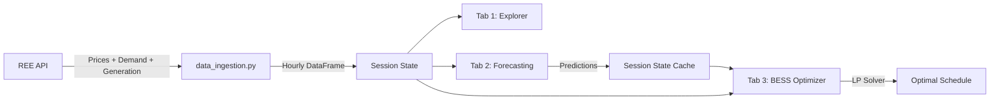

<p align="center">
  <h1 align="center">⚡ BESS Optimizer 🔋</h1>
  <p align="center">
    <strong>End-to-End Battery Energy Storage System Optimizer for the Spanish Electricity Market</strong>
  </p>
  <p align="center">
    <a href="#-quick-start">Quick Start</a> •
    <a href="#-features">Features</a> •
    <a href="#-architecture">Architecture</a> •
    <a href="#-models">Models</a> •
    <a href="#-license">License</a>
  </p>
</p>

---

## 📋 Overview

**Eco-Optimizer BESS** is an interactive Streamlit dashboard that connects the full pipeline from **real-time electricity market data ingestion** (REE API) through **multi-model time series forecasting** to **optimal battery arbitrage scheduling** using Linear Programming.

Built as part of an MSc Data Science Time Series project, it demonstrates how a Battery Energy Storage System (BESS) can maximize arbitrage profit by buying electricity when prices are low and selling when prices are high — all driven by AI-powered price predictions.

## 🚀 Quick Start

```bash
# 1. Clone the repository
git clone https://github.com/SergioBeamonte/Eco-Optimizer-BESS.git
cd Eco-Optimizer-BESS

# 2. Create a virtual environment (recommended)
python -m venv venv
venv\Scripts\activate        # Windows
# source venv/bin/activate   # Linux/Mac

# 3. Install dependencies
pip install -r requirements.txt

# 4. (Optional) Install Amazon Chronos T5 for foundation model predictions
pip install torch
pip install git+https://github.com/amazon-science/chronos-forecasting.git

# 5. Launch the dashboard
python -m streamlit run dashboard.py
```

Or simply **double-click `start.bat`** on Windows.

## ✨ Features

### 📥 Tab 1 — Historical Data Explorer
- **Live REE API integration** — Downloads hourly price, demand, and generation data from Red Eléctrica de España
- **Interactive time series charts** with Plotly (dark theme, zoomable, hover tooltips)
- **Daily energy mix pie charts** showing the percentage breakdown by technology (solar, wind, nuclear, etc.)
- **Temporal range slider** for quick zooming into specific periods
- **Progress bar** during data download with real-time status updates

### 🔮 Tab 2 — Multi-Model Forecasting Lab
- **7 forecasting algorithms** to compare head-to-head on the same hold-out set
- **Per-variable prediction** — Choose to forecast Price, Demand, or Generation independently
- **Persistent session storage** — Run models one-by-one; results accumulate in the comparison table
- **Dynamic metrics table** showing Status (⏳ Pending / ✅ Completed), MAE, RMSE, and MAPE
- **Automatic best-model highlighting** — Minimum error values highlighted in green
- **Multi-model overlay chart** — All predictions plotted against ground truth for visual comparison

### 🔋 Tab 3 — BESS Arbitrage Optimizer
- **Linear Programming solver** (PuLP CBC) maximizing arbitrage profit
- **Configurable battery parameters**: Capacity (kWh), Max Power (kW), Round-trip Efficiency, Initial SoC
- **Precise time window selection** — Choose the exact start date, hour, and simulation duration
- **Price source selection** — Optimize using real historical prices or any model's predictions from Tab 2
- **Financial results dashboard**: Arbitrage Profit (€), Total Energy Charged/Discharged (MWh)
- **Dual-panel visualization**: Market prices (top) + Charge/Discharge bars with SoC curve (bottom)

## 🏗 Architecture

```
Eco-Optimizer-BESS/
│
├── dashboard.py              # Main Streamlit application (3 tabs)
├── start.bat                 # Windows launcher script
├── requirements.txt          # Python dependencies
│
├── src/
│   └── data_ingestion.py     # REE API client (prices, generation, demand)
│
├── models/                   # Standalone model scripts (for reference / CLI usage)
│   ├── 01_sarima.py
│   ├── 02_varima.py
│   ├── 03_xgboost_sota.py
│   ├── 04_lstm_sota.py
│   └── 05_bess_optimizer.py
│
└── data/
    └── raw/                  # Downloaded CSVs (auto-generated, git-ignored)
```

### Data Pipeline



## 🤖 Models

| # | Model | Type | Description |
|---|-------|------|-------------|
| 01 | **Naive (Daily Mean)** | Statistical | Predicts the average of the last 24h as a baseline |
| 02 | **Seasonal Naive** | Statistical | Repeats the last 24h cycle ($y_{t+96} = y_t$) |
| 03 | **Holt-Winters** | Exp. Smoothing | Classical decomposition with trend + 24h seasonality |
| 04 | **SARIMA** | Statistical (Seasonal) | Seasonal ARIMA with 24h periodicity |
| 05 | **VARIMA** | Statistical (Multivariate) | Auto-VARIMA: ADF/AIC optimized multivariate system |
| 06 | **Random Forest** | Bagging Ensemble | Parallel trees with adaptive feature selection |
| 07 | **XGBoost** | Gradient Boosting | Ensemble of trees with adaptive feature selection |
| 08 | **Amazon Chronos T5** | Foundation Model | Pre-trained transformer for zero-shot forecasting |
| 09 | **BESS Optimizer** | Linear Programming | Optimal buy/sell schedule via LP Arbitrage (PuLP) |

## 🔧 Technical Details

### REE API Integration
The dashboard fetches data from three REE endpoints:
- **Prices**: `apidatos.ree.es/es/datos/mercados/precios-mercados-tiempo-real` (15-min → resampled to hourly)
- **Generation**: `apidatos.ree.es/es/datos/generacion/estructura-generacion` (daily → demand-weighted hourly proxy)
- **Demand**: `apidatos.ree.es/es/datos/demanda/evolucion` (hourly)

> **Note**: REE's generation endpoint only returns daily totals. The system synthesizes realistic hourly profiles using a demand-proportional weighting algorithm that distributes daily generation across hours following the actual load curve.

### BESS Optimization Formulation
The LP problem maximizes:

$$\text{Profit} = \sum_{t=0}^{T} \left( p_t \cdot P_d^t - p_t \cdot P_c^t \right) \cdot \Delta t$$

Subject to:
- $\text{SoC}^t = \text{SoC}^{t-1} + P_c^t \cdot \eta \cdot \Delta t - \frac{P_d^t}{\eta} \cdot \Delta t$
- $0 \leq \text{SoC}^t \leq C_{\text{max}}$
- $0 \leq P_c^t, P_d^t \leq P_{\text{max}}$

Where $p_t$ is the market price, $\eta$ is round-trip efficiency, and $C_{\text{max}}$, $P_{\text{max}}$ are the battery capacity and power limits.

## 📊 Metrics

Each model is evaluated using:
- **MAE** (Mean Absolute Error) — Average magnitude of errors
- **RMSE** (Root Mean Squared Error) — Penalizes large deviations
- **MAPE** (Mean Absolute Percentage Error) — Scale-independent accuracy measure

## 📦 Dependencies

| Package | Purpose |
|---------|---------|
| `streamlit` | Interactive web dashboard |
| `plotly` | Rich interactive charts |
| `pandas` / `numpy` | Data manipulation |
| `scikit-learn` | Random Forest, metrics |
| `xgboost` | Gradient Boosting |
| `statsmodels` | SARIMA, VAR, Holt-Winters |
| `PuLP` | Linear Programming solver |
| `torch` + `chronos` | *(Optional)* Foundation model |

## 📄 License

This project is licensed under the **MIT License** — see the [LICENSE](LICENSE) file for details.

## 👤 Author

**Sergio Beamonte González**
MSc Data Science — Time Series Analysis
Universidad Politécnica de Madrid • 2026

---

<p align="center">
  ⚡ BESS Optimizer 🔋
</p>

